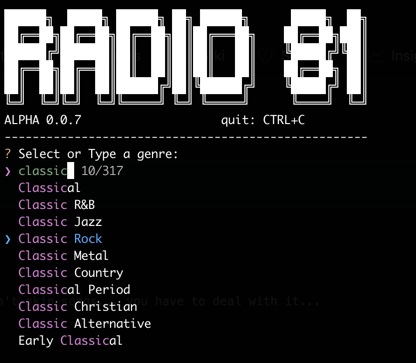

# Radio 81

A classical command line old tube radio, you can't skip songs... you have to deal with it... Just relax and listen...
like it used to be...



```shell
# Install Radio 81 using pipx
pipx install radio81
# or with pip
pip install radio81

# And now... Run it...

radio81
```

## Additional notes


This is an Alpha version I wrote during a mystical crisis so don't blame anyone if that doesn't work in every situation.
It will be better soon... or probably not... I find it so lovely as it is... even with the exception when you press CTRL+C.

I almost forgot... Thanks to Shoutcast and people who are making those beautiful radio stations...